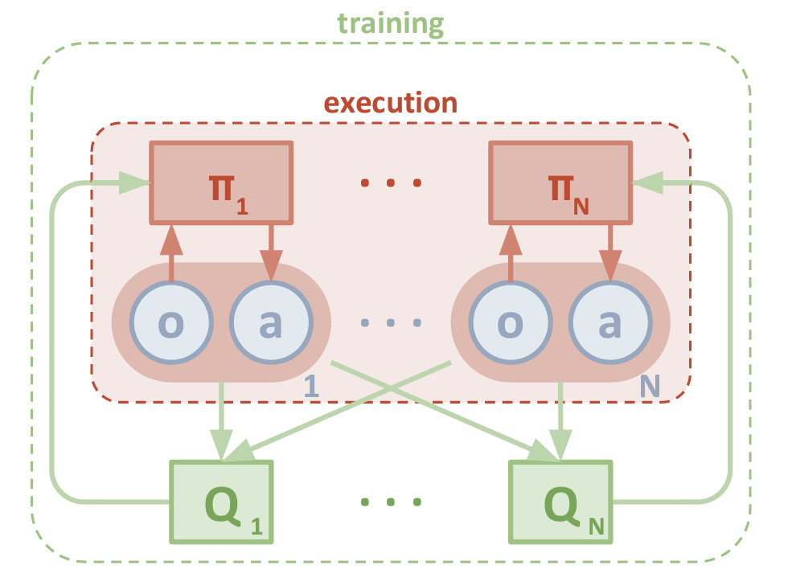
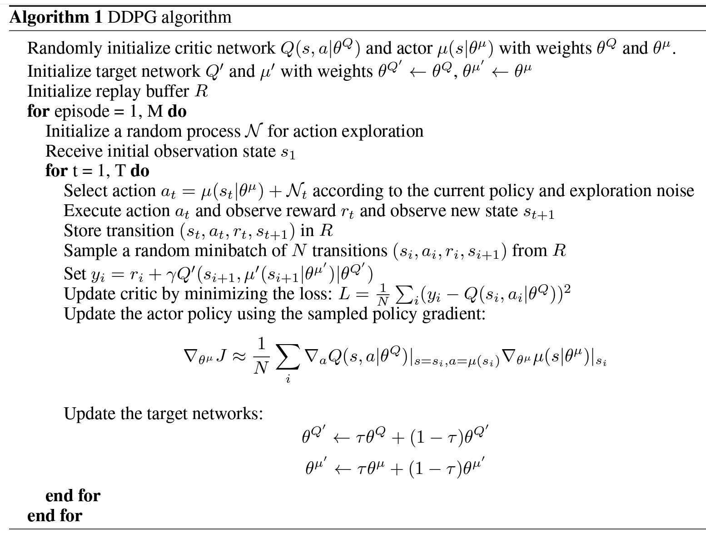
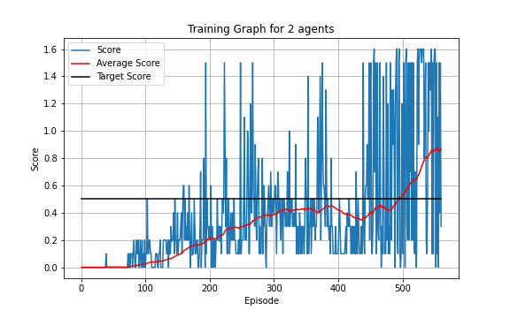
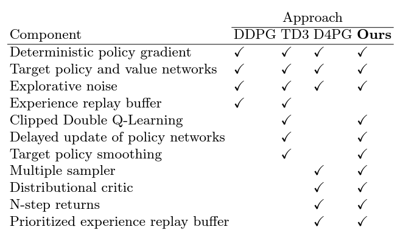

# <u>Continuous Control Report</u>

The goal of this project is to train 2 agents to play tennis against each other using either collaboration.

#### <u>Environment</u>

The environment consists of 2 rackets that hit a ball at each other. If the ball goes over the net, a reward of +0.1 is received. If the ball bounces on the ground or falls out of bounds, a reward of -0.01 is received. The goal is therefore to keep the ball in play. There are 2 continuous action spaces that the agent can play, and they relate to the movements left/right and up/down both in the range [-1:1]. The state space consists of 24 observations describing the position and velocity of the ball and racket. This is used to feed into the neural network.

To solve the environment, an average of +0.5 points needs to be achieved over 100 episodes. The score is taken from the max score of both agents.

#### <u>Learning Algorithm</u>
The implementation used was Multi-agent Deep Deterministic Policy Gradient (MADDPG) where the actor is decentralised and the critic is centralised as shown in the paper [Multi-Agent Actor-Critic for Mixed Cooperative-Competitive Environments](https://papers.nips.cc/paper/7217-multi-agent-actor-critic-for-mixed-cooperative-competitive-environments.pdf)

||
|:--:| 
| *Image 1: Multi-agent decentralized actor, centralized critic.* |
| *Reference [Multi-Agent Actor-Critic for Mixed Cooperative-Competitive Environments](https://papers.nips.cc/paper/7217-multi-agent-actor-critic-for-mixed-cooperative-competitive-environments.pdf)* |

The core algorithm uses DDPG, which consists of 2 agents, an Actor and a Critic. The Actor is used to predict the outcome of a given state, and the Critic is used to estimate the q value using gradient ascent. Both networks also get a target network and uses a soft update. 

The Multi-agent part of the algorithm is then calculated as such: During training, the actor and critic are updated together from the same experience pool. When in gameplay mode, the states are fed into the network creating independent action spaces. This DDPG implementation also includes a number of improvements as shown further in the report.

For more details on the DDPG implementation, refer to the paper [Continuous control with deep reinforcement learning](https://arxiv.org/abs/1509.02971) by Timothy P. et al.

||
|:--:|
| *Image 2: Pseudocode for Deep Deterministic Policy Gradient (DDPG)* |
| *Reference: [Continuous control with deep reinforcement learning](https://arxiv.org/abs/1509.02971) by Timothy P. et al.* |

The Actor-Critic neural networks were compiled from the library [Pytorch](https://pytorch.org/) and network weights were initialised using a uniform Glorot initialization. The implementation consists of the following:

<b>Actor Network: </b>The network consists of an input layer (taken from the state space), 2 hidden layers with [256,128] neurons, and a final output layer, which is a continuous action space of 2 values in the range of [-1:1]. A dropout of 0.25 was added to both hidden layers to avoid overfitting. Thereafter, noise was then added to the action space using an [Ornstein–Uhlenbeck](https://en.wikipedia.org/wiki/Ornstein%E2%80%93Uhlenbeck_process) noise process to engage exploration.

<b>Critic Network: </b>The network consists of an input layer (taken from the state space), 2 hidden layers with [256,128] neurons, and a final output layer which consists of a single neuron. The action state as predicted by the Actor is inserted with the state sapce to the first hidden layer.

<b>Prioritised Experience Replay: </b>
A Prioritised Experience replay method was used to avoid correlations. Priority was assigned using Sum Tree and was adapted from this [MIT implimentation](https://github.com/rlcode/per). The memory size used was 500000 with a replay size of 1000.

<b>Reward Normalization: </b>Rewards are normalised for each training sample. This is because 0.1 may be a good reward in the beginning but later on, 0.5 will be a much better reward

Gradient clipping is also used to stabilise learning. Hyperparameters used:

|Variable|Value|
|:--|:--|
| gamma | 0.95 |
| tau | 0.01
| Actor Learning rate | 0.0001|
| Critic Learning rate | 0.001|
| Actor Drop out | 25% | 
| Critic Drop out | 0% | 
| Update Frequency | 20 |
| Learning Steps | 100 |
| Memory Size | 500000 |
| Replay Size | 1000 |
| Maxumin Time Steps | 300 |

All code imports used can be found in the utils folder and consists of:

| File Name | Description |
|:--|:--|
| actorCritic.py | The Neural Network setup for the Actor and Critic | 
| agent.py | The agent used to act, learn and update itself | 
| per.py | Prioritised Memory replay |
| noise.py | Ornstein–Uhlenbeck process |

#### <b>Result</u>

The environment successfully managed to achieve an average score of over 0.5 within 100 episodes at episode 394. The training was continued until the scores started flattening out around an average of 0.85. This could be due to the time step limit set per game of 300.

||
|:--:| 
| *Image 3: Network training score. An average of 0.5 was achieved by episode 394.*  |

#### <u>Improvements</u>

Some improvements that could be considered:

- Adding noise to the weights and biases of the Actor-network instead of the actions as shown in the following article by [OpenAI](https://openai.com/blog/better-exploration-with-parameter-noise/).
(*Gaussian noise was attempted to be added to the parameters of the Local Actor, however, seemed to throw the network off completely. A smarter implementation as shown by OpenAI should be investigated*).
- Use a [Distributed Distributional Deterministic Policy Gradients (D4PG)](https://openreview.net/forum?id=SyZipzbCb) 
- There is also some interesting research investigating the implementation of a combination of DDPG, D4PG and TD3, which can be investigated as shown the paper
"[Learn to Move Through a Combination of Policy Gradient Algorithms: DDPG, D4PG, and TD3](chrome-extension://efaidnbmnnnibpcajpcglclefindmkaj/https://core.ac.uk/download/pdf/340076771.pdf)"

||
|:--:| 
| *Image 4: Possible improvements to combine.* |
| *Reference [Learn to Move Through a Combination of Policy Gradient Algorithms: DDPG, D4PG, and TD3](chrome-extension://efaidnbmnnnibpcajpcglclefindmkaj/https://core.ac.uk/download/pdf/340076771.pdf)* |
